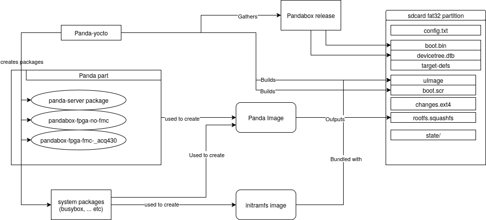

# Panda Yocto Structure Proposal
DONE!
- [Test release](https://github.com/PandABlocks/meta-panda/releases/download/4.0alpha1/boot@pandabox-4.0alpha1.zip)
- Main repo: [meta-panda](https://github.com/PandABlocks/meta-panda)
- [PR PandABlocks-server#64](https://github.com/PandABlocks/PandABlocks-server/pull/64)
- [PR PandABlocks-server#66](https://github.com/PandABlocks/PandABlocks-server/pull/66)
- [PR PandABlocks-FPGA#244](https://github.com/PandABlocks/PandABlocks-FPGA/pull/244)
- [PR PandABlocks-slowFPGA#4](https://github.com/PandABlocks/PandABlocks-slowFPGA/pull/4)

Possible improvements:
- Automatic deployment of everything inside the CI
- Packaging/building of webcontrol
- USB automount feature?
- Should we use the SDK in panda server CI?
- Some warning messages
- Cleaner docker image?
- Using kas to simplify build workflow

# Requirements
- [x] Req 1: Having a simple upgrade process (e.g. copying a few files to the SD
  card).
- [x] Req 2: Having a persistent state for supporting tests, designs and logging.
- [x] Req 3: Having a simple test process for development.
- [x] Req 4: Supporting 3rd party packages.
- [x] Req 5: The versions between all the packages should always be consistent.
- [x] Req 6: Last logs must be saved after graceful reboot.
- [x] Req 7: The first partition should contain a folder called state/ to contain
  the designs and panda.state.
- [x] Req 8: Keep `/boot/config.txt`.
- [x] Req 9: Keep `/boot/authorized_keys`.
- [x] Req 10: Support Zeroconf networking.
- [x] Req 11: Keep `/qspi` for MAC address and SSH host keys.
  - it was renamed to `/persistent` to make it general for all targets.
- [x] Req 12: Keep LED daemon.
- [x] Req 13: Multiple FPGA flavors can be available. The FPGA loader will first
  check if there is only a flavor (in which case load it unconditionally), else
  will look for overrides in the boot.txt parameter FPGA\_FIRMWARE, if that
  doesn't exist or it is set to auto, it will auto detect using I2C, if that
  doesn't work, it will default to the no-fmc flavor.
- [x] Req 14: Webadmin should be present and use ipk instead
- [x] Req 15: The FPGA repo should produce its associated ipk packages
  - PR `PandABlocks/PandABlocks-FPGA#244`
- [x] Req 16: Network configuration should be overriden by USB drive with file
  `panda-config.txt`. This implies that the USB drive should be auto-mounted.
  - Not fully tested yet.

# Proposal

- Fully updating a panda just requires to copy 5 files (which could come from an
  automatically created bundle), no repartitioning
  needed. Why is this good? repartitioning at boot time is a fragile task (with
  many failure modes) that I've seen failing a few times in the past. The new
  way can only fail (in an obvious way) if you don't have enough room to copy
  the files (in which case, get a bigger sdcard).
- We can still keep `config.txt` to facilitate network configuration from
  outside.
- Panda-yocto could have the option to get the FPGA part either from a release
  or from a directory pointed by the user.
- `state/` folder contains the designs and panda.state.
- A SDK can be generated from yocto so that developers can use the same
  toolchain without having to deal with yocto.

## Images
The images are:
- `initramfs.cpio.tar`: it contains the needed packages to mount and move to the
  definitive rootfs.
- `rootfs.squashfs`: definitive rootfs, it contains system packages and panda
  packages including all the flavors of FMCs. Even though it is called
  `rootfs.squashfs` for convenience, this is actually
  `petalinux-image-minimal.squashfs` with the panda packages added (and possibly
  some extra system packages). The filesystem was decided to be squashfs for
  many reasons.
    - Size is less than half the original size, therefore now it fits in the
      fat32 partition of an old panda SD card, simplifying upgrade.
    - The blocks are integrity checked and corruption can be detected.
    - The file can be hashed to check for corruption, while in other filesystem
      like ext4, the hash changes with normal use, given that it writes metadata
      even mounting read-only.
- `changes.ext4`: Initially it doesn't exist and it is the created (empty) by
  the init script.

Having all the packages in `rootfs.squashfs` is better to ensure that all the
parts are consistent with each other.

This structure supports requirements Req 1, Req 2, Req 3 and Req 4.

## Implementation notes
- Journald is configured to store persistently with long flush period (Req 6).
- Package manager is opkg (Req 4). 
- Programming the FPGA will be a different service to starting the server.
- root account has been enabled and the usual password configured.
- `/boot` was removed from the image, the init script will mount that location
  anyways.
- webadmin could get the panda related output from `journalctl -u panda-*` and
  system logs from `journalctl -k`.
- The SDK has been installed under
  `/dls_sw/work/targetOS/petalinux-v2023.2-zynq-toolchain`. The development
  environment can be loaded by running:
  `. /dls_sw/work/targetOS/petalinux-v2023.2-zynq-toolchain/environment-setup-cortexa9t2hf-neon-xilinx-linux-gnueabi`

### Initramfs init script
The init script mounts the images, then mount an overlayfs using packages as
lower layers(immutable) and changes as upper layer, finally, switch root and
exec init system.

The result is a system that will merge the content of packages and state but any
write will be changing only `changes.ext4` (e.g. when installing packages), any
messed up system can be recovered by deleting `changes.ext4`.

The full init script can be seen in the meta-panda layer [here](https://github.com/PandABlocks/meta-panda/blob/rel-v2023.2/recipes-core/initrdscripts/files/pinit).

## FAQ
### How do we test a part of software in development?
We have 2 options: either you create a package using the panda-yocto repository
and then install it or you scp the built files individually; any of those
actions will produce the modification of only `state.ext4`.
The last approach can be improved by making the panda repositories create
image directories as a result, for example, PandABlock-server could
create the following build result:
- `/build/image/usr/bin/panda-server`
- `/build/image/lib/modules/.../panda.ko`
- `/build/image/etc/systemd/system/panda-server.service`
- ...
Then, the only thing you need to do to update the panda is:
`rsync -ra /build/image/ panda-host:/`

### While testing, the system broke, how to recover?
Delete `state.ext4` from the sdcard. Another option is manually mounting
 `state.ext4` and going over its content to fix the problem (from outside the
 panda).

### How can we include all the FMC variants in one image without conflicts?
This will require changes in some of the panda repos to rename output files
differently so that they can coexists in the same image.
Additionally, the server will need to accept a parameter to know the variant so
that it can use the proper `registers` and `config` files.
The selection of the flavor can be automated in the server start script based on
information coming from the I2C bus. An alternative way to specify the flavor is
by setting a variable in the `config.txt`.

### How do we upgrade an old panda?
- Offline upgrade: we just repartition the SD card to use all the space and copy
the 5 required files.
- Live upgrade: we replace the initramfs in /boot with the new one and copy the
  5 required files to /opt/, then reboot, the init script in initramfs
  if it doesn't have all the required files, will try to mount /opt, copy the
  files to RAM, repartition to use the full SD card in one fat32 partition,
  then copy the files back.
  For convenience to allow upgrading from the web interface, we package the 5
  required files and a service script in a zpkg (this could be our default
  release format to support this upgrade process always), the service script
  will do the steps described earlier.

### Error `operation not supported error, dev loop1, sector 1608 op 0x9:(WRITE_ZEROES) flags 0x800 phys_seg 0 prio class 2`
This error appears when the state.ext4 image is created, apparently some
initialization does the WRITE\_ZEROES operation which the underlying vfat
filesystem doesn't support, the system continues running ... so, it probably did
the operation in the slow way and then this message doesn't appear anymore. More
 investigation is needed to confirm this is fine.
 
 A workaround was found, mkfs.ext4 with options `lazy_journal_init=0` and
 `lazy_itable_init=0`. This initialization is the only thing that seems to need
 the `WRITE_ZEROES` operation.

 Apparently, this happens when `fallocate` is called with flag
 `FALLOC_FL_ZERO_RANGE` which is not supported by the underlying loop device.
 Whether this is a problem or not, depends if the caller falls back to zeroing
 the slow way.

## How to build the panda server using the yocto SDK?
- Load the SDK environment
```bash
. /dls_sw/work/targetOS/petalinux-v2023.2-zynq-toolchain/environment-setup-cortexa9t2hf-neon-xilinx-linux-gnueabi
```
- Modify your CONFIG to have the following variables set
```makefile
CROSS_COMPILE =
# needed if you want to build the driver too
KERNER_DIR = /dls_sw/work/targetOS/petalinux-v2023.2-zynq-toolchain/sysroots/cortexa9t2hf-neon-xilinx-linux-gnueabi/lib/modules/6.1.60-xilinx-v2023.2/build
```
- Make
```bash
make clean # needed if there was already a build
make server
# build the driver
make driver CROSS_COMPILE=arm-xilinx-linux-gnueabi-
```

Note: the kernel sources might be missing some scripts, so fix that,
run `make scripts && make prepare` inside the kernel sources directory after
having loaded the SDK environment
